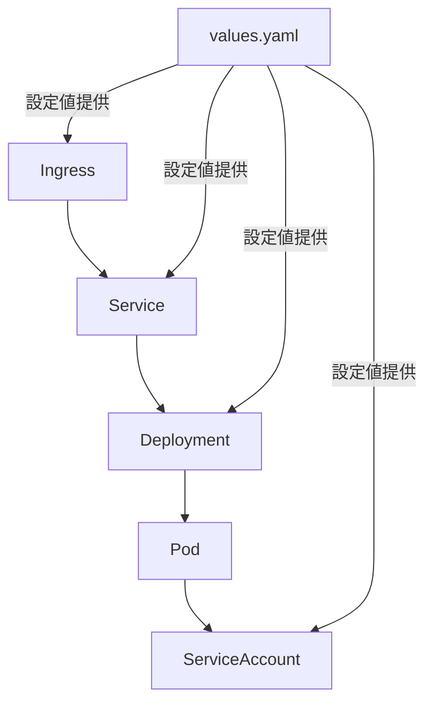

# Kubernetes Helmチャート解説

このドキュメントでは、Helmチャートの構造と各コンポーネントの関係性について説明します。

## ディレクトリ構造

```
helm-chart/
├── Chart.yaml           # チャートのメタデータ
├── values.yaml         # デフォルト設定値
├── templates/          # Kubernetesマニフェストのテンプレート
│   ├── _helpers.tpl   # 共通のテンプレート関数
│   ├── deployment.yaml    # アプリケーションのデプロイ設定
│   ├── service.yaml      # サービス（内部通信）設定
│   ├── ingress.yaml      # Ingress（外部通信）設定
│   └── serviceaccount.yaml # 認証・認可設定
└── charts/            # 依存チャート（使用する場合）
```

## コンポーネント間の関係



## デプロイメントフロー

1. **初期化**
   - `helm install`コマンドの実行
   - `values.yaml`の読み込み
   - テンプレート変数の展開

2. **リソース作成順序**
   - ServiceAccount作成
   - Deployment作成（Pod生成）
   - Service作成
   - Ingress作成

3. **通信フロー**
   - 外部リクエスト → Ingress
   - Ingress → Service
   - Service → Pod
   - Pod ⟷ Kubernetes API（ServiceAccount認証）

## 主要コンポーネントの役割

### 1. Chart.yaml
- チャートの基本情報を定義
- バージョン管理
- 依存関係の管理

### 2. values.yaml
- 環境ごとの設定値を定義
- デプロイメント設定
- スケーリング設定
- リソース制限
- 環境変数

### 3. _helpers.tpl
- 共通のテンプレート関数を定義
- 名前生成ロジック
- ラベル管理
- セレクター管理

### 4. デプロイメント関連ファイル
#### deployment.yaml
- Podの作成・管理
- コンテナ設定
- リソース制限
- ヘルスチェック
- 環境変数

#### service.yaml
- クラスター内通信の設定
- ロードバランシング
- ポート設定
- サービスディスカバリ

#### ingress.yaml
- 外部通信の設定
- ルーティングルール
- TLS設定
- パスベースルーティング

#### serviceaccount.yaml
- Pod認証設定
- RBAC連携
- クラウドプロバイダー連携

## 設定のカスタマイズ

### 1. 基本的な設定変更
values.yamlを編集することで、以下の設定をカスタマイズ可能：
- アプリケーション名
- 環境設定
- コンテナイメージ
- リソース制限
- レプリカ数

### 2. 高度なカスタマイズ
- テンプレートファイルの編集
- ヘルパー関数の追加
- カスタムリソースの追加

## デバッグとトラブルシューティング

### 1. よく使用するコマンド
```bash
# テンプレートの検証
helm template .

# マニフェストの確認
helm get manifest <リリース名>

# リソースの状態確認
kubectl get all
kubectl describe <リソース種類> <リソース名>

# ログの確認
kubectl logs <Pod名>
```

### 2. よくある問題と解決方法
- イメージプル失敗 → イメージ名とタグの確認
- Pod起動失敗 → リソース制限とヘルスチェックの確認
- サービス疎通不可 → セレクターとラベルの確認
- Ingress接続不可 → ホスト名とパス設定の確認

## ベストプラクティス

1. **セキュリティ**
   - 最小権限の原則に従う
   - 機密情報はSecretsで管理
   - 不要なサービス公開を避ける

2. **可用性**
   - 適切なヘルスチェックの設定
   - リソース制限の適切な設定
   - オートスケーリングの活用

3. **保守性**
   - 命名規則の統一
   - 適切なラベル付け
   - コメントの充実

4. **パフォーマンス**
   - リソース要求と制限の最適化
   - キャッシュの活用
   - 効率的なイメージ管理

## 環境別の設定管理

1. **開発環境（development）**
   - デバッグ機能の有効化
   - リソース制限の緩和
   - ログレベルの詳細化

2. **ステージング環境（staging）**
   - 本番相当の設定
   - テストデータの使用
   - モニタリングの有効化

3. **本番環境（production）**
   - セキュリティの強化
   - スケーラビリティの確保
   - バックアップの設定
